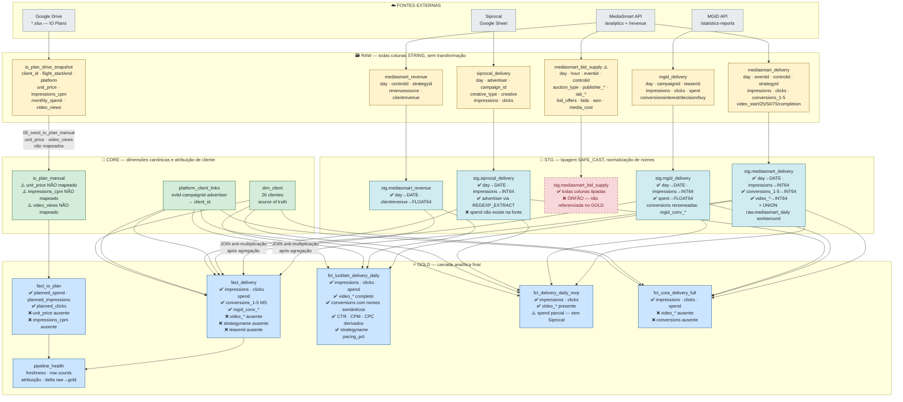
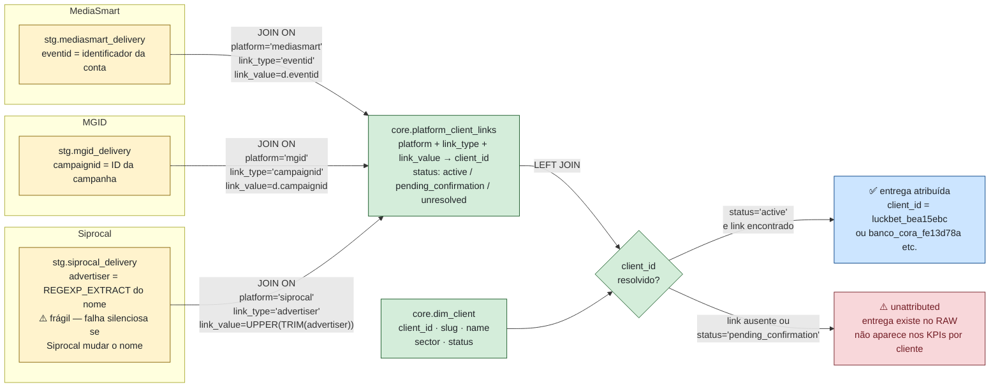
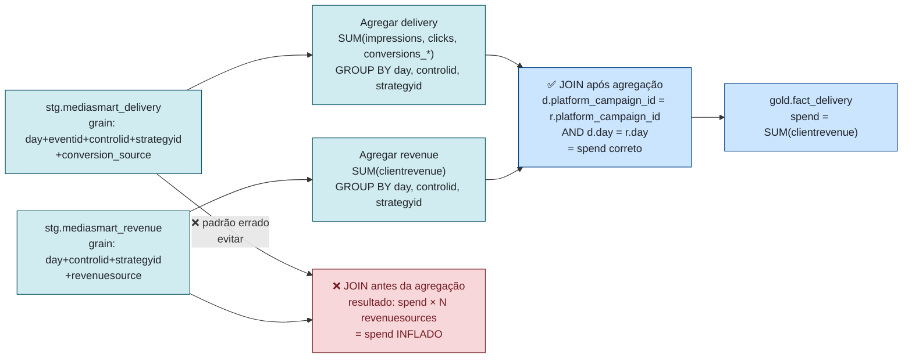
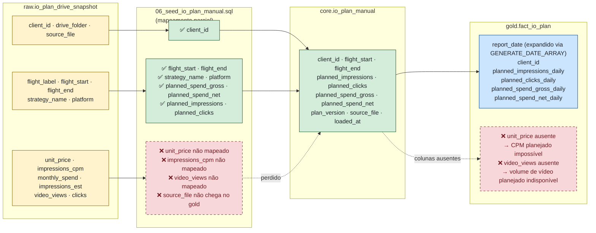
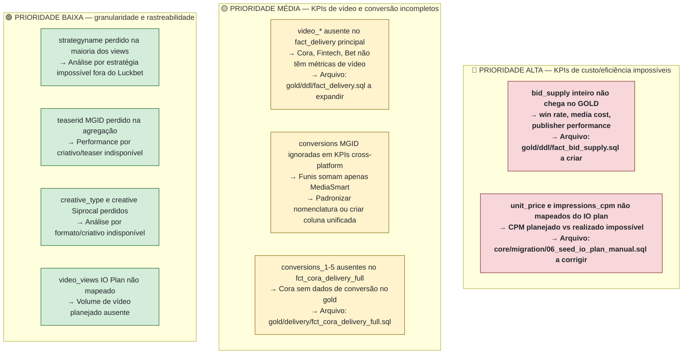

# Column Lineage Map — RAW → STG → CORE → GOLD

---
> **⚠️ LEGADO — PRÉ-REBUILD 2026-06-16 ⚠️**
> Este documento descreve a pipeline **anterior ao reset completo de 2026-06-16**.
> Tabelas, views, schemas e colunas aqui descritos **foram dropados e não existem mais no BigQuery**.
> Mantenha para consulta histórica — **não use como referência para desenvolvimento novo.**
> Plano atual: [bq_restructuring_plan.md](bq_restructuring_plan.md) · [CHANGELOG.md](../CHANGELOG.md)
---

> Última atualização: 2026-06-11  
> Autor: Douglas Reche  
> Propósito: Rastrear transformação **coluna a coluna** por todas as camadas do pipeline. Identifica onde informações são perdidas antes de chegar nos KPIs.  
> Complementa: `pipeline_complete_map.md` (grain e dependências por tabela)

---

## 1. Arquitetura Geral — Visão em Camadas

---

## 2. Cadeia de Atribuição de Cliente

A atribuição é o **ponto crítico de perda de linhas**: se um `eventid` / `campaignid` / `advertiser` não tiver vínculo ativo em `platform_client_links`, a entrega fica como `unattributed` — existe no RAW mas é invisível nos KPIs por cliente.

**Regra de atribuição por plataforma:**

| Plataforma | Campo de JOIN | Granularidade | Risco |
|---|---|---|---|
| MediaSmart | `eventid` | Conta (herda todas as campanhas) | Baixo — 1 vínculo cobre toda conta |
| MGID | `campaignid` | Campanha individual | Médio — cada campanha precisa de 1 vínculo |
| Siprocal | `advertiser` (texto) | Nome do anunciante | Alto — texto frágil, falha silenciosa |

---

## 3. Linhagem de Colunas — MediaSmart Delivery

### 3.1 Fluxo do JOIN Revenue anti-multiplicação

O spend MediaSmart vem em grain diferente (`day + controlid + strategyid + revenuesource`). Se o JOIN for feito antes da agregação, cada linha de delivery é multiplicada pelo número de `revenuesource` por estratégia — gerando spend inflado.

### 3.2 Tabela de colunas — mediasmart_delivery

| Coluna RAW | Tipo RAW | Transformação STG | Tipo STG | fact_delivery | fct_luckbet | fct_mvp | fct_cora | Observação |
|---|---|---|---|---|---|---|---|---|
| `day` | STRING | `SAFE_CAST AS DATE` | DATE | ✅ `day` | ✅ `date` | ✅ `date` | ✅ `date` | |
| `eventid` | STRING | pass-through | STRING | JOIN PCL | JOIN PCL | JOIN PCL | JOIN PCL | Identifica conta MediaSmart |
| `controlid` | STRING | pass-through | STRING | `platform_campaign_id` | `platform_campaign_id` | `platform_campaign_id` | `platform_campaign_id` | ID da campanha |
| `strategyid` | STRING | pass-through | STRING | agregado (perdido) | agregado (perdido) | agregado (perdido) | agregado (perdido) | ID da estratégia — perde granularidade |
| `strategyname` | STRING | pass-through | STRING | ❌ ausente | ✅ presente | ❌ ausente | ❌ ausente | Nome da estratégia perdido na maioria dos views |
| `conversion_source` | STRING | pass-through | STRING | ❌ ausente | ❌ ausente | ❌ ausente | ❌ ausente | Fonte da conversão — perdida no gold |
| `impressions` | STRING | `SAFE_CAST AS INT64` | INT64 | ✅ SUM | ✅ SUM | ✅ SUM | ✅ SUM | |
| `clicks` | STRING | `SAFE_CAST AS INT64` | INT64 | ✅ SUM | ✅ SUM | ✅ SUM | ✅ SUM | |
| `conversions_1` | STRING | `SAFE_CAST AS INT64` | INT64 | ✅ SUM | ✅ `pageviews` | ✅ SUM | ❌ ausente | Mapeamento semântico via dim_conversion_mapping |
| `conversions_2` | STRING | `SAFE_CAST AS INT64` | INT64 | ✅ SUM | ✅ `cadastros` | ✅ SUM | ❌ ausente | |
| `conversions_3` | STRING | `SAFE_CAST AS INT64` | INT64 | ✅ SUM | ✅ `ftds` | ✅ SUM | ❌ ausente | is_primary=TRUE para Luckbet |
| `conversions_4` | STRING | `SAFE_CAST AS INT64` | INT64 | ✅ SUM | ✅ `depositos_recorrentes` | ✅ SUM | ❌ ausente | |
| `conversions_5` | STRING | `SAFE_CAST AS INT64` | INT64 | ✅ SUM | ✅ `inicio_cadastro` | ✅ SUM | ❌ ausente | |
| `video_start` | STRING | `SAFE_CAST AS INT64` | INT64 | ❌ ausente | ✅ SUM | ✅ SUM | ❌ ausente | Perdido no fact_delivery principal |
| `video_25_viewed` | STRING | `SAFE_CAST AS INT64` | INT64 | ❌ ausente | ✅ SUM | ✅ SUM | ❌ ausente | |
| `video_50_viewed` | STRING | `SAFE_CAST AS INT64` | INT64 | ❌ ausente | ✅ SUM | ✅ SUM | ❌ ausente | |
| `video_75_viewed` | STRING | `SAFE_CAST AS INT64` | INT64 | ❌ ausente | ✅ SUM | ✅ SUM | ❌ ausente | |
| `video_completion` | STRING | `SAFE_CAST AS INT64` | INT64 | ❌ ausente | ✅ SUM | ✅ SUM | ❌ ausente | |
| `platform` | STRING | literal `'mediasmart'` | STRING | ✅ | ✅ | ✅ | ✅ | Adicionado na STG |
| `raw_ingested_at` | TIMESTAMP | pass-through | TIMESTAMP | ❌ ausente | ❌ ausente | ❌ ausente | ❌ ausente | Apenas para auditoria RAW/STG |

### 3.3 Tabela de colunas — mediasmart_revenue

| Coluna RAW | Tipo RAW | Transformação STG | Tipo STG | fact_delivery | fct_luckbet | Observação |
|---|---|---|---|---|---|---|
| `day` | STRING | `SAFE_CAST AS DATE` | DATE | JOIN key | JOIN key | |
| `controlid` | STRING | → `platform_campaign_id` | STRING | JOIN key | JOIN key | |
| `strategyid` | STRING | pass-through | STRING | agregado antes do JOIN | agregado antes do JOIN | |
| `revenuesource` | STRING | pass-through | STRING | ❌ ausente | ❌ ausente | Canal de revenue — perdido no gold |
| `clientrevenue` | STRING | `SAFE_CAST AS FLOAT64` | FLOAT64 | ✅ `spend` SUM | ✅ `receita_dsp` | JOIN feito APÓS agregação para evitar multiplicação |

---

## 4. Linhagem de Colunas — mediasmart_bid_supply ⚠️ TABELA ÓRFÃ

> **Status: ÓRFÃ.** A view `stg.mediasmart_bid_supply` existe e está tipada corretamente, mas **nenhum arquivo em `gold/`** a referencia. Toda informação de eficiência de leilão está inacessível para KPIs.

| Coluna RAW | Tipo RAW | Tipo STG | Chega no GOLD? | KPI perdido |
|---|---|---|---|---|
| `day` | STRING | DATE | ❌ | — |
| `hour` | STRING | INT64 | ❌ | Análise intraday impossível |
| `eventid` | STRING | STRING | ❌ | — |
| `controlid` | STRING | STRING | ❌ | — |
| `strategyid` | STRING | STRING | ❌ | — |
| `auction_type` | STRING | STRING | ❌ | Distribuição leilão aberto vs privado |
| `ad_exchange` | STRING | STRING | ❌ | Performance por exchange |
| `publisher_id` | STRING | STRING | ❌ | Performance por publisher |
| `publisher_name` | STRING | STRING | ❌ | — |
| `iab_category` | STRING | STRING | ❌ | Performance por categoria IAB |
| `iab_subcategory` | STRING | STRING | ❌ | — |
| `bid_offers` | STRING | INT64 | ❌ | Oportunidades de leilão |
| `bids` | STRING | INT64 | ❌ | Lances enviados |
| `won` | STRING | INT64 | ❌ | Lances ganhos (win rate = won/bids) |
| `media_cost` | STRING | FLOAT64 | ❌ | Custo de mídia real (antes de markup) |
| `total_bids_cost` | STRING | FLOAT64 | ❌ | Custo total de lances |
| `impressions` | STRING | INT64 | ❌ | Redundante com delivery, mas em grain horário |
| `clicks` | STRING | INT64 | ❌ | — |
| `conversions_1-5` | STRING | INT64 | ❌ | — |

**Para desbloquear:** criar `gold/ddl/fact_bid_supply.sql` que consome `stg.mediasmart_bid_supply` com JOIN em `platform_client_links`. Ver `docs/etl_expansion_plan.md`.

---

## 5. Linhagem de Colunas — MGID

| Coluna RAW | Tipo RAW | Transformação STG | Tipo STG | fact_delivery | fct_mvp | fct_cora | Observação |
|---|---|---|---|---|---|---|---|
| `day` | STRING | `SAFE_CAST AS DATE` | DATE | ✅ | ✅ | ✅ | |
| `campaignid` | STRING | → `platform_campaign_id` | STRING | JOIN PCL | JOIN PCL | JOIN PCL | |
| `teaserid` | STRING | pass-through | STRING | ❌ ausente | ❌ ausente | ❌ ausente | ID do criativo/teaser — perdido na agregação |
| `impressions` | STRING | `SAFE_CAST AS INT64` | INT64 | ✅ SUM | ✅ SUM | ✅ SUM | |
| `clicks` | STRING | `SAFE_CAST AS INT64` | INT64 | ✅ SUM | ✅ SUM | ✅ SUM | |
| `spent` | STRING | `SAFE_CAST AS FLOAT64` | FLOAT64 | ✅ `spend` SUM | ✅ SUM | ✅ SUM | Spend já vem na mesma grain da delivery |
| `conversionsinterest` | STRING | `SAFE_CAST AS INT64` | INT64 | ✅ `mgid_conv_interest` | ⚠️ renomeado? | ❌ ausente | Funil MGID — nome diferente do MediaSmart |
| `conversionsdecision` | STRING | `SAFE_CAST AS INT64` | INT64 | ✅ `mgid_conv_decision` | ⚠️ renomeado? | ❌ ausente | |
| `conversionsbuy` | STRING | `SAFE_CAST AS INT64` | INT64 | ✅ `mgid_conv_buy` | ⚠️ renomeado? | ❌ ausente | |
| `platform` | STRING | literal `'mgid'` | STRING | ✅ | ✅ | ✅ | |

> **Atenção — KPIs cruzados:** qualquer cálculo de conversão que soma `conversions_1 + conversions_2 + ...` **ignora MGID completamente**, pois MGID usa `mgid_conv_*`. Funis cross-platform ficam incorretos.

---

## 6. Linhagem de Colunas — Siprocal

| Coluna RAW | Tipo RAW | Transformação STG | Tipo STG | fact_delivery | fct_mvp | fct_cora | Observação |
|---|---|---|---|---|---|---|---|
| `day` | STRING | `SAFE_CAST AS DATE` | DATE | ✅ | ✅ | ✅ | |
| `advertiser` | STRING | `REGEXP_EXTRACT(UPPER(TRIM(advertiser)), r'^NEWAD_(.+)_BR_\w+$')` | STRING | JOIN PCL | JOIN PCL | JOIN PCL | Extrai slug do nome "NEWAD_{SLUG}_BR_{MES}{ANO}" |
| `campaign_id` | STRING | → `platform_campaign_id` | STRING | ✅ | ✅ | ✅ | |
| `campaign_name` | STRING | pass-through | STRING | ❌ ausente | ❌ ausente | ❌ ausente | Nome completo perdido no gold |
| `creative_type` | STRING | pass-through | STRING | ❌ ausente | ❌ ausente | ❌ ausente | Tipo do criativo — perdido |
| `creative` | STRING | pass-through | STRING | ❌ ausente | ❌ ausente | ❌ ausente | Nome do criativo — perdido |
| `impressions` | STRING | `SAFE_CAST AS INT64` | INT64 | ✅ SUM | ✅ SUM | ✅ SUM | |
| `clicks` | STRING | `SAFE_CAST AS INT64` | INT64 | ✅ SUM | ✅ SUM | ✅ SUM | |
| `spend` | ❌ não existe | — | — | NULL | NULL | NULL | Siprocal não fornece dado de custo |
| `platform` | STRING | literal `'siprocal'` | STRING | ✅ | ✅ | ✅ | |

> **Dado desatualizado:** última atualização do Siprocal foi março/2026. ETL depende de `scripts/etl/sync_sheet.py` rodado manualmente.

---

## 7. Linhagem — IO Plan (Drive Snapshot → Core → Gold)

| Coluna RAW (drive_snapshot) | Tipo | Chega em core.io_plan_manual? | Chega em gold.fact_io_plan? | Observação |
|---|---|---|---|---|
| `client_id` | STRING | ✅ | ✅ | |
| `flight_label` | STRING | ✅ | ✅ | |
| `flight_start` | STRING | ✅ → DATE | ✅ | |
| `flight_end` | STRING | ✅ → DATE | ✅ | |
| `strategy_name` | STRING | ✅ | ✅ | |
| `platform` | STRING | ✅ | ✅ | |
| `monthly_spend` | STRING | ✅ → NUMERIC `planned_spend_gross` | ✅ `planned_spend_gross_daily` | Distribuído linearmente por dia |
| `impressions_est` | STRING | ✅ → INT64 `planned_impressions` | ✅ `planned_impressions_daily` | |
| `clicks` | STRING | ✅ → INT64 `planned_clicks` | ✅ `planned_clicks_daily` | |
| `unit_price` | STRING | ❌ não mapeado | ❌ ausente | Necessário para CPM/CPC planejado |
| `impressions_cpm` | STRING | ❌ não mapeado | ❌ ausente | Impressões previstas para compra CPM |
| `video_views` | STRING | ❌ não mapeado | ❌ ausente | Volume de vídeo planejado |
| `drive_folder` | STRING | ✅ `source_file` (auditoria) | ❌ ausente | Rastreabilidade do arquivo fonte |

---

## 8. Matriz de Cobertura de Métricas por View GOLD

> ✅ = presente e correto | ⚠️ = parcial ou com ressalvas | ❌ = ausente | — = não aplicável

| Métrica | fact_delivery | fct_luckbet_daily | fct_delivery_mvp | fct_cora_full | fct_newad_bet | fct_newad_fintech | pipeline_health |
|---|---|---|---|---|---|---|---|
| impressions | ✅ | ✅ | ✅ | ✅ | ✅ | ✅ | ✅ delta |
| clicks | ✅ | ✅ | ✅ | ✅ | ✅ | ✅ | ✅ delta |
| spend (MS + MGID) | ✅ | ✅ | ⚠️ sem Siprocal | ✅ | ✅ | ✅ | ✅ |
| spend (Siprocal) | ❌ fonte | ❌ fonte | ❌ fonte | ❌ fonte | ❌ fonte | ❌ fonte | ❌ fonte |
| conversions_1-5 (MS) | ✅ | ✅ semântico | ✅ | ❌ | ✅ | ✅ | — |
| mgid_conv_interest | ✅ | — | ⚠️ | ❌ | ⚠️ | ⚠️ | — |
| mgid_conv_decision | ✅ | — | ⚠️ | ❌ | ⚠️ | ⚠️ | — |
| mgid_conv_buy | ✅ | — | ⚠️ | ❌ | ⚠️ | ⚠️ | — |
| video_start | ❌ | ✅ | ✅ | ❌ | ❌ | ❌ | — |
| video_25/50/75 | ❌ | ✅ | ✅ | ❌ | ❌ | ❌ | — |
| video_completion | ❌ | ✅ | ✅ | ❌ | ❌ | ❌ | — |
| video_completion_rate % | ❌ | ✅ derivado | ✅ derivado | ❌ | ❌ | ❌ | — |
| CTR % | ❌ | ✅ derivado | ⚠️ | ❌ | ❌ | ❌ | — |
| CPM realizado | ❌ | ✅ derivado | ❌ | ❌ | ❌ | ❌ | — |
| CPC realizado | ❌ | ✅ derivado | ❌ | ❌ | ❌ | ❌ | — |
| pacing % | ❌ | ✅ | ❌ | ❌ | ❌ | ❌ | ⚠️ |
| planned_spend | — | ✅ via IO | ❌ | ❌ | ❌ | ❌ | ✅ |
| unit_price | — | ❌ | ❌ | ❌ | ❌ | ❌ | ❌ |
| strategyname | ❌ | ✅ | ❌ | ❌ | ❌ | ❌ | — |
| creative_type | — | — | ❌ | ❌ | ❌ | ❌ | — |
| publisher/exchange | — | — | — | — | — | — | — |
| win_rate (bids/won) | — | — | — | — | — | — | — |

---

## 9. Resumo de Lacunas — Priorizado por Impacto nos KPIs

| # | Lacuna | Camada perdida | Arquivos envolvidos | KPI afetado |
|---|---|---|---|---|
| L1 | `mediasmart_bid_supply` não chega no GOLD | STG → GOLD | `gold/ddl/fact_bid_supply.sql` (a criar) | Win rate, custo real de mídia, performance por publisher/exchange |
| L2 | `unit_price`, `impressions_cpm` não mapeados do IO plan | RAW → CORE | `core/migration/06_seed_io_plan_manual.sql` | CPM planejado, volume CPM previsto vs realizado |
| L3 | `video_*` ausentes no `fact_delivery` | STG → GOLD | `gold/ddl/fact_delivery.sql` | Taxa de conclusão de vídeo para Cora, Bet, Fintech |
| L4 | Conversões MGID com nomes diferentes | GOLD (nomenclatura) | Qualquer query que some `conversions_*` | Funil cross-platform conta só MediaSmart |
| L5 | `conversions_1-5` ausentes no `fct_cora_delivery_full` | STG → GOLD | `gold/delivery/fct_cora_delivery_full.sql` | Conversões Cora inexistentes no gold |
| L6 | `strategyname` perdido na agregação | STG → GOLD | `gold/ddl/fact_delivery.sql` | Análise por estratégia em clientes além de Luckbet |
| L7 | `teaserid` MGID perdido na agregação | STG → GOLD | Qualquer fact MGID | Análise de performance por criativo MGID |
| L8 | `creative_type`, `creative` Siprocal perdidos | STG → GOLD | `gold/ddl/fact_delivery.sql` | Análise de formato por criativo Siprocal |
| L9 | `video_views` do IO plan não mapeado | RAW → CORE | `core/migration/06_seed_io_plan_manual.sql` | Volume de vídeo previsto no planejamento |

---

## 10. Notas de Manutenção

- **Siprocal spend:** ausência é **da fonte** — a plataforma não expõe custo. Não é uma lacuna do pipeline, é uma limitação da integração. Ver `docs/api_capabilities.md`.
- **MediaSmart workaround jun/26:** `stg.mediasmart_delivery` usa `UNION ALL` com `raw.mediasmart_daily` para cobrir dados pós-2026-05-24. Remover quando o orchestrator do Shiro for corrigido. Issue `#9`.
- **fact_io_plan quebrada:** `gold.fact_io_plan` retorna zero linhas por chain morta (`raw.luckbet_io_plan_snapshot` dropada em 2026-05-26). Issue `#8`.
- **Siprocal desatualizado:** último dado é março/2026. Requer `scripts/etl/sync_sheet.py` manual.
