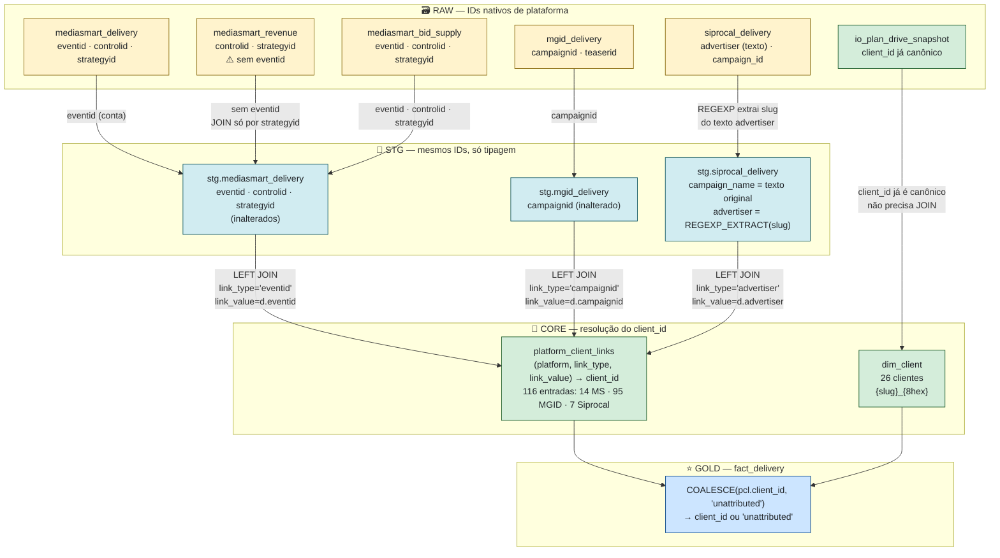
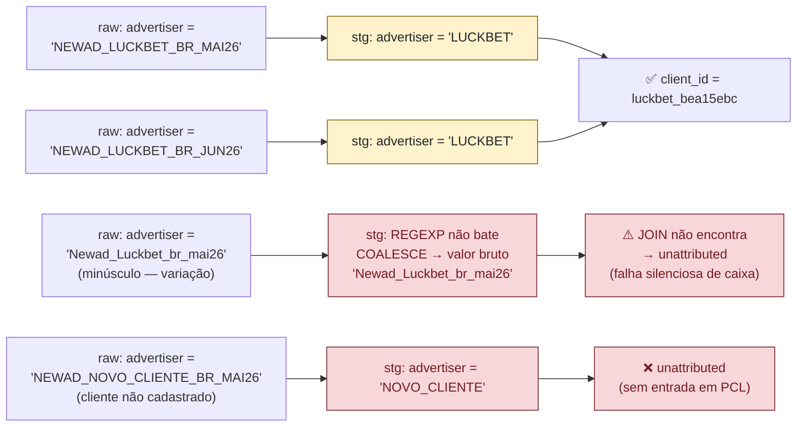

# Mapa de Atribuição de IDs — RAW → client_id

---
> **⚠️ LEGADO — PRÉ-REBUILD 2026-06-16 ⚠️**
> Este documento descreve a pipeline **anterior ao reset completo de 2026-06-16**.
> Tabelas, views, schemas e colunas aqui descritos **foram dropados e não existem mais no BigQuery**.
> Mantenha para consulta histórica — **não use como referência para desenvolvimento novo.**
> Plano atual: [bq_restructuring_plan.md](bq_restructuring_plan.md) · [CHANGELOG.md](../CHANGELOG.md)
---

> Última atualização: 2026-06-15
> Autor: Douglas Reche
> Propósito: Para cada tabela RAW, mostra exatamente onde o `client_id` é resolvido, onde delivery se perde como `unattributed`, e quais IDs precisam de ação.
> Complementa: `column_lineage_map.md` (linhagem de colunas) | `pipeline_complete_map.md` (grain e dependências)

---

## 1. Fluxo geral de atribuição



---

## 2. MediaSmart — atribuição via `eventid` (nível de conta)

### Como funciona
Um `eventid` = uma conta MediaSmart = um cliente NewAd. Toda campanha criada sob aquela conta herda o vínculo automaticamente — **você não precisa mapear cada campanha individualmente**.

### Estado atual dos vínculos
```
14 eventids mapeados em platform_client_links:
  ✅ 12 active  (Amigo ativado 2026-06-08; Stocco + Dr Consulta RJ ativados 2026-06-15)
  ⚠️  1 pending_confirmation  (Caloi)
  ❌  1 unresolved — sem client_id — entrega vai para 'unattributed'
```

### Mapa de eventids

| eventid (abreviado) | client_id | Status | Ação necessária |
|---|---|---|---|
| `newad_brazil-dzynx...` | `luckbet_bea15ebc` | ✅ active | — |
| `newad_brazil-2ruu4...` | `banco_cora_fe13d78a` | ✅ active | — |
| `newad_brazil-nvwu1...` | `casa_construtor_adf15c2c` | ✅ active | — |
| `newad_brazil-oignl...` | `einstein_6b33a588` | ✅ active | — |
| `newad_brazil-lmslp...` | `aperam_14d1f27e` | ✅ active | — |
| `newad_brazil-1viks...` | `mrv_f19a2136` | ✅ active | — |
| `newad_brazil-mew7x...` | `efi_bank_ee79e91b` | ✅ active | — |
| `newad_brazil-0ormck...` | `fox_lux_55ed8992` | ✅ active | — |
| `newad_brazil-plbe1...` | `dooing_994db77e` | ✅ active | — |
| `newad_brazil-oqdfn...` | `amigo_db1c2f0c` | ✅ active | Ativado 2026-06-08 — Amigo é sub-cliente legítimo de TecPar |
| `newad_brazil-a5e1o...` | `dr_consulta_rj_11040bf9` | ✅ active | Ativado 2026-06-15 — dim_client status=active confirmado |
| `newad_brazil-4au3o...` | `stocco_b712c66e` | ✅ active | Ativado 2026-06-15 — dim_client status=active confirmado |
| `newad_brazil-fqpt3...` | `caloi_8ac28140` | ⚠️ pending | Aguarda confirmação comercial |
| `newad_brazil-neu83...` | ❌ **NULL — unresolved** | ❌ unresolved | **Pardini OU Ocupacional — decidir e separar** |

### Clientes ativos SEM eventid MediaSmart → ficam `unattributed` se rodarem campanha MS

| Cliente | Situação |
|---|---|
| `pardini_60395024` | Eventid unresolved compartilhado com Ocupacional |
| `ocupacional_98c851f5` | **Zero vínculos em qualquer plataforma** — todo dado vai para `unattributed` |
| `senar_105bd174` | Sem eventid MS — só tem MGID |
| `mopar_a47949f4` | Sem eventid MS — só tem MGID |
| `patio_medeiros_874a0358` | Sem eventid MS — só tem MGID |
| `townhouses_bc40f009` | Sem eventid MS — só tem MGID |
| `dr_consulta_215378ef` | Sem eventid MS — tem MGID + Siprocal |

### Bug identificado no fact_delivery — `strategyid` como `platform_campaign_id`

```sql
-- gold/ddl/fact_delivery.sql linha 26 — atual (errado):
d.strategyid AS platform_campaign_id

-- correto deveria ser:
d.controlid AS platform_campaign_id
```

O campo `platform_campaign_id` para MediaSmart no GOLD é `strategyid` (nível de estratégia), não `controlid` (nível de campanha). Para MGID e Siprocal é o ID correto de campanha. **Análise cross-platform por campanha está comparando granularidades diferentes.**

---

## 3. MGID — atribuição via `campaignid` (nível de campanha)

### Como funciona
Cada campanha MGID precisa de uma entrada individual em `platform_client_links`. **Não há herança automática** — nova campanha = novo mapeamento manual obrigatório.

### Estado atual dos vínculos
```
95 campaignids mapeados em platform_client_links:
  ✅ 51 active    → 14 clientes cobertos
  ⚠️ 44 pending  → 9 clientes (Amigo 39, Stoquinho 4, Stocco 3, Caloi 2, Bet7k 4, Lab2lab 1, Catalise 1, Dr Consulta RJ 3)
```

### Distribuição por cliente (MGID)

| Cliente | Campaigns mapeadas | Status |
|---|---|---|
| `luckbet_bea15ebc` | 10 | ✅ todas active |
| `banco_cora_fe13d78a` | 16 | ✅ todas active |
| `aperam_14d1f27e` | 8 | ✅ todas active |
| `pardini_60395024` | 11 | ✅ todas active |
| `amigo_db1c2f0c` | 39 | ⚠️ todas pending_confirmation |
| `dr_consulta_215378ef` | 4 | ✅ todas active |
| `fox_lux_55ed8992` | 1 | ✅ active |
| `efi_bank_ee79e91b` | 2 | ✅ active |
| `mrv_f19a2136` | 1 | ✅ active |
| `mopar_a47949f4` | 3 | ✅ active |
| `patio_medeiros_874a0358` | 2 | ✅ active |
| `townhouses_bc40f009` | 1 | ✅ active |
| `einstein_6b33a588` | 4 | ✅ active |
| `dooing_994db77e` | 1 | ✅ active |
| `senar_105bd174` | 2 | ✅ active |
| `dr_consulta_rj_11040bf9` | 3 | ⚠️ pending |
| `stoquinho_56a6ee2a` | 4 | ⚠️ pending |
| `stocco_b712c66e` | 3 | ⚠️ pending |
| `caloi_8ac28140` | 2 | ⚠️ pending |
| `bet7k_b777ab9c` | 4 | ⚠️ pending |
| `lab2lab_efb1cb34` | 1 | ⚠️ pending |
| `catalise_0b7d18d6` | 1 | ⚠️ pending |

### Risco principal MGID

> Qualquer campanha MGID criada após 2026-05-26 que não esteja neste CSV vai para `unattributed` **silenciosamente**, sem nenhum erro ou alerta. O `pipeline_health` mostra `pct_imp_unattributed` para monitorar isso.

---

## 4. Siprocal — atribuição via texto extraído (`advertiser`)

### Como funciona
O campo `advertiser` na RAW tem formato `NEWAD_{SLUG}_BR_{MES}{ANO}`. A STG extrai o `{SLUG}` via REGEXP e o JOIN usa esse slug como `link_value`.

```
raw.siprocal_delivery.advertiser = "NEWAD_LUCKBET_BR_MAI26"
  ↓ stg: REGEXP_EXTRACT → "LUCKBET"
  ↓ JOIN platform_client_links ON link_type='advertiser' AND link_value='LUCKBET'
  → client_id = 'luckbet_bea15ebc'
```

### Estado atual dos vínculos
```
7 advertiser slugs mapeados:
  ✅ 5 active
  ⚠️ 2 pending_confirmation
```

### Mapa de advertiser slugs

| Slug extraído | client_id | Status | Ação necessária |
|---|---|---|---|
| `LUCKBET` | `luckbet_bea15ebc` | ✅ active | — |
| `APERAM` | `aperam_14d1f27e` | ✅ active | — |
| `DRCONSULTA` | `dr_consulta_215378ef` | ✅ active | — |
| `BANCOCORA` | `banco_cora_fe13d78a` | ✅ active | — |
| `DOOING` | `dooing_994db77e` | ✅ active | — |
| `PARDINI` | `pardini_60395024` | ✅ active | — |
| `AMIGOTECPAR` | `amigo_db1c2f0c` | ⚠️ pending | Slug cobre Amigo+TecPar juntos — separar quando comercial confirmar |
| `TECPAR` | `tecpar_edfcc744` | ⚠️ pending | Aguarda confirmação |

### Riscos Siprocal



| Risco | Causa | Impacto |
|---|---|---|
| Mudança de nome pela Siprocal | `LUCKBET` vira `LUCK_BET` → REGEXP extrai `LUCK_BET` → sem match | Entrega vai para `unattributed` sem erro |
| Variação de caixa | minúsculo não é normalizado antes do JOIN | Falha silenciosa |
| Cliente novo não cadastrado | Slug extraído não tem entrada em `platform_client_links` | `unattributed` sem aviso |
| Slug cobre dois clientes (`AMIGOTECPAR`) | Um slug → dois clientes reais | Dados misturados até separação |
| Dados desatualizados | Último dado Siprocal = mar/2026 | ETL manual parado |

---

## 5. IO Plan — sem necessidade de JOIN de atribuição

O `io_plan_drive_snapshot` já usa `client_id` canônico diretamente (inferido da estrutura de pastas do Drive). Não passa por `platform_client_links`.

```
Google Drive /CORA/2026/MAIO/plano.xlsx
  ↓ script inferência
  → client_id = 'banco_cora_fe13d78a'  ← já canônico
  → core.io_plan_manual
  → gold.fact_io_plan
```

Não há risco de atribuição aqui. O risco é de mapeamento incorreto da pasta do Drive para o `client_id`, o que é manual e fora do pipeline.

---

## 6. Mapa geral — cobertura de atribuição por cliente e plataforma

| Cliente | Status | MS eventid | MGID campaigns | Siprocal advertiser | Observação |
|---|---|---|---|---|---|
| `luckbet_bea15ebc` | ✅ active | ✅ | ✅ 10 | ✅ | Cobertura completa |
| `banco_cora_fe13d78a` | ✅ active | ✅ | ✅ 16 | ✅ | Cobertura completa |
| `aperam_14d1f27e` | ✅ active | ✅ | ✅ 8 | ✅ | Cobertura completa |
| `einstein_6b33a588` | ✅ active | ✅ | ✅ 4 | ❌ | Sem Siprocal |
| `mrv_f19a2136` | ✅ active | ✅ | ✅ 1 | ❌ | Sem Siprocal |
| `fox_lux_55ed8992` | ✅ active | ✅ | ✅ 1 | ❌ | Sem Siprocal |
| `efi_bank_ee79e91b` | ✅ active | ✅ | ✅ 2 | ❌ | Sem Siprocal |
| `pardini_60395024` | ✅ active | ❌ unresolved | ✅ 11 | ✅ | MS unresolved com Ocupacional |
| `casa_construtor_adf15c2c` | ✅ active | ✅ | ❌ | ❌ | Só MediaSmart |
| `dooing_994db77e` | ✅ active | ✅ | ✅ 1 | ✅ | Cobertura completa |
| `senar_105bd174` | ✅ active | ❌ | ✅ 2 | ❌ | Só MGID |
| `mopar_a47949f4` | ✅ active | ❌ | ✅ 3 | ❌ | Só MGID |
| `patio_medeiros_874a0358` | ✅ active | ❌ | ✅ 2 | ❌ | Só MGID |
| `townhouses_bc40f009` | ✅ active | ❌ | ✅ 1 | ❌ | Só MGID |
| `dr_consulta_215378ef` | ✅ active | ❌ | ✅ 4 | ✅ | Sem MS |
| `ocupacional_98c851f5` | ✅ active | ❌ | ❌ | ❌ | **⛔ ZERO vínculos — 100% unattributed** |
| `amigo_db1c2f0c` | ✅ active | ✅ active | ✅ 39 active | ✅ active | Ativado 2026-06-08 — sub-cliente TecPar confirmado |
| `tecpar_edfcc744` | ⚠️ pending | ❌ | ❌ | ⚠️ pending | Só Siprocal AMIGOTECPAR (compartilhado) |
| `stocco_b712c66e` | ✅ active | ✅ active | ✅ 3 active | ❌ | Ativado 2026-06-15 |
| `stoquinho_56a6ee2a` | — | ❌ | ⚠️ 4 pending | ❌ | Aguarda separação Stocco vs Stoquinho |
| `dr_consulta_rj_11040bf9` | ✅ active | ✅ active | ✅ 3 active | ❌ | Ativado 2026-06-15 |
| `bet7k_b777ab9c` | ⚠️ pending | ❌ | ⚠️ 4 pending | ❌ | Aguarda confirmação comercial |
| `lab2lab_efb1cb34` | ⚠️ pending | ❌ | ⚠️ 1 pending | ❌ | Aguarda confirmação comercial |
| `caloi_8ac28140` | ⚠️ pending | ⚠️ pending | ⚠️ 2 pending | ❌ | Aguarda confirmação comercial |
| `catalise_0b7d18d6` | ⚠️ pending | ❌ | ⚠️ 1 pending | ❌ | 1.2M imp mar/26 não atribuídos |

---

## 7. IDs prioritários para ação

### 🔴 Ação imediata (impactam clientes active com dados perdidos)

| # | O que fazer | Arquivo | Impacto |
|---|---|---|---|
| A1 | Resolver o eventid compartilhado Pardini/Ocupacional — decidir se são contas separadas ou uma conta, e criar 1 ou 2 entradas com `client_id` definido | `core/seeds/platform_client_links.csv` + `core/migration/07_fix_pardini_ocupacional.sql` | Toda entrega MS de Pardini e Ocupacional hoje é `unattributed` |
| A2 | Criar pelo menos 1 vínculo para `ocupacional_98c851f5` (MGID ou Siprocal, se tiver dados) — ou determinar se o cliente existe e está ativo mesmo sem entrega | `core/seeds/platform_client_links.csv` | Único cliente `active` com zero vínculos |
| A3 | Corrigir `fact_delivery.sql`: usar `controlid` em vez de `strategyid` como `platform_campaign_id` para MediaSmart | `gold/ddl/fact_delivery.sql` linha 26 | `platform_campaign_id` MediaSmart é estratégia, não campanha — análise cross-platform incorreta |

### 🟡 Ação quando comercial confirmar (não bloqueia hoje)

| # | O que fazer | Clientes envolvidos |
|---|---|---|
| B1 | Confirmar e ativar vínculos Amigo vs TecPar — definir se são clientes separados ou pai/filho | `amigo_db1c2f0c`, `tecpar_edfcc744` |
| B2 | Confirmar Stocco vs Stoquinho — separar corretamente os campaignids de cada um | `stocco_b712c66e`, `stoquinho_56a6ee2a` |
| B3 | Confirmar Dr Consulta SP vs RJ — se são clientes independentes, manter 2 IDs; se for o mesmo, consolidar | `dr_consulta_215378ef`, `dr_consulta_rj_11040bf9` |
| B4 | Ativar ou descartar Bet7k, Lab2lab, Caloi, Catalise — se têm contrato real, ativar; se não, marcar `inactive` | 4 clientes pending |

### 🟢 Manutenção contínua (processo operacional)

| # | O que fazer | Frequência |
|---|---|---|
| C1 | Auditar MGID: toda nova campanha criada na plataforma precisa de entrada manual em `platform_client_links` | A cada nova campanha |
| C2 | Monitorar `pipeline_health.pct_imp_unattributed` — alerta se > 5% das impressões estão sem cliente | Semanal |
| C3 | Verificar se a Siprocal mudou o padrão de nome do campo `advertiser` quando dados forem desatualizados | A cada atualização manual do Siprocal |
| C4 | Adicionar eventid MS para Senar, Mopar, Patio Medeiros, Townhouses se eles iniciarem campanhas MS | Quando iniciar campanha nova |
