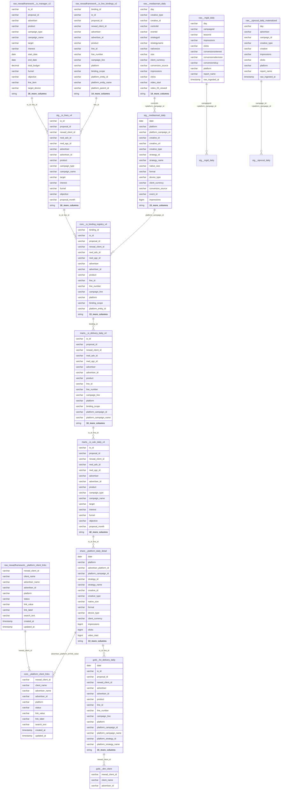

# AdFramework ERD — Core Delivery Pipeline

```mermaid
erDiagram
  raw__mediasmart_daily {
    varchar day
    varchar creative_type
    varchar creative_id
    varchar controlid
    varchar eventid
    varchar strategyid
    varchar strategyname
    varchar nativesize
    varchar size
    varchar client_currency
    varchar conversion_source
    varchar impressions
    varchar clicks
    varchar video_start
    varchar video_25_viewed
    string __14_more_columns__
  }
  raw__mgid_daily {
    varchar day
    varchar campaignid
    varchar teaserid
    varchar impressions
    varchar clicks
    varchar conversionsinterest
    varchar conversionsdecision
    varchar conversionsbuy
    varchar platform
    varchar report_name
    timestamp raw_ingested_at
  }
  raw__siprocal_daily_materialized {
    varchar day
    varchar advertiser
    varchar campaign_id
    varchar creative_type
    varchar creative
    varchar impressions
    varchar clicks
    varchar platform
    varchar report_name
    timestamp raw_ingested_at
  }
  raw_newadframework__io_manager_v2 {
    varchar io_id
    varchar proposal_id
    varchar advertiser
    varchar product
    varchar campaign_type
    varchar campaign_name
    varchar target
    varchar interest
    date start_date
    date end_date
    decimal total_budget
    varchar funnel
    varchar objective
    varchar line_item
    varchar target_device
    string __16_more_columns__
  }
  raw_newadframework__io_line_bindings_v2 {
    varchar binding_id
    varchar io_id
    varchar proposal_id
    varchar newad_client_id
    varchar advertiser
    varchar advertiser_id
    varchar product
    varchar line_id
    varchar line_number
    varchar campaign_line
    varchar platform
    varchar binding_scope
    varchar platform_entity_id
    varchar platform_entity_name
    varchar platform_parent_id
    string __14_more_columns__
  }
  raw_newadframework__platform_client_links {
    varchar newad_client_id
    varchar client_name
    varchar advertiser_name
    varchar advertiser_id
    varchar platform
    varchar status
    varchar link_value
    varchar link_label
    varchar search_text
    timestamp created_at
    timestamp updated_at
  }
  stg__mediasmart_daily {
    date date
    varchar platform
    varchar platform_campaign_id
    varchar creative_id
    varchar creative_url
    varchar creative_type
    varchar strategy_id
    varchar strategy_name
    varchar native_size
    varchar format
    varchar device_type
    varchar client_currency
    varchar conversion_source
    varchar event_id
    bigint impressions
    string __15_more_columns__
  }
  stg__io_lines_v4 {
    varchar io_id
    varchar proposal_id
    varchar newad_client_id
    varchar nwd_adv_id
    varchar nwd_agc_id
    varchar advertiser
    varchar advertiser_id
    varchar product
    varchar campaign_type
    varchar campaign_name
    varchar target
    varchar interest
    varchar funnel
    varchar objective
    varchar proposal_month
    string __16_more_columns__
  }
  core__io_binding_registry_v4 {
    varchar binding_id
    varchar io_id
    varchar proposal_id
    varchar newad_client_id
    varchar nwd_adv_id
    varchar nwd_agc_id
    varchar advertiser
    varchar advertiser_id
    varchar product
    varchar line_id
    varchar line_number
    varchar campaign_line
    varchar platform
    varchar binding_scope
    varchar platform_entity_id
    string __13_more_columns__
  }
  core__platform_client_links {
    varchar newad_client_id
    varchar client_name
    varchar advertiser_name
    varchar advertiser_id
    varchar platform
    varchar status
    varchar link_value
    varchar link_label
    varchar search_text
    timestamp created_at
    timestamp updated_at
  }
  marts__io_calc_daily_v4 {
    varchar io_id
    varchar proposal_id
    varchar newad_client_id
    varchar nwd_adv_id
    varchar nwd_agc_id
    varchar advertiser
    varchar advertiser_id
    varchar product
    varchar campaign_type
    varchar campaign_name
    varchar target
    varchar interest
    varchar funnel
    varchar objective
    varchar proposal_month
    string __42_more_columns__
  }
  marts__io_delivery_daily_v4 {
    varchar io_id
    varchar proposal_id
    varchar newad_client_id
    varchar nwd_adv_id
    varchar nwd_agc_id
    varchar advertiser
    varchar advertiser_id
    varchar product
    varchar line_id
    varchar line_number
    varchar campaign_line
    varchar platform
    varchar binding_scope
    varchar platform_campaign_id
    varchar platform_campaign_name
    string __16_more_columns__
  }
  share__platform_daily_detail {
    date date
    varchar platform
    varchar advertiser_platform_id
    varchar platform_campaign_id
    varchar strategy_id
    varchar strategy_name
    varchar creative_id
    varchar creative_type
    varchar native_size
    varchar format
    varchar device_type
    varchar client_currency
    bigint impressions
    bigint clicks
    bigint video_start
    string __13_more_columns__
  }
  gold__fct_delivery_daily {
    date date
    varchar io_id
    varchar proposal_id
    varchar newad_client_id
    varchar advertiser
    varchar advertiser_id
    varchar product
    varchar line_id
    varchar line_number
    varchar campaign_line
    varchar platform
    varchar platform_campaign_id
    varchar platform_campaign_name
    varchar platform_strategy_id
    varchar platform_strategy_name
    string __15_more_columns__
  }
  gold__dim_client {
    varchar newad_client_id
    varchar client_name
    varchar advertiser_id
  }

  raw__mediasmart_daily ||--o{ stg__mediasmart_daily : "controlid->platform_campaign_id"
  raw__mgid_daily ||--o{ stg__mgid_daily : "campaignid->platform_campaign_id"
  raw__siprocal_daily_materialized ||--o{ stg__siprocal_daily : "campaign_id->platform_campaign_id"
  raw_newadframework__io_manager_v2 ||--o{ stg__io_lines_v4 : "io_id, line_id"
  raw_newadframework__io_line_bindings_v2 ||--o{ stg__io_lines_v4 : "line_id"
  raw_newadframework__platform_client_links ||--o{ core__platform_client_links : "newad_client_id"
  stg__io_lines_v4 ||--o{ core__io_binding_registry_v4 : "io_id, line_id"
  stg__mediasmart_daily ||--o{ core__io_binding_registry_v4 : "platform_campaign_id"
  core__io_binding_registry_v4 ||--o{ marts__io_delivery_daily_v4 : "binding_id"
  marts__io_delivery_daily_v4 ||--o{ marts__io_calc_daily_v4 : "io_id, line_id"
  marts__io_calc_daily_v4 ||--o{ share__platform_daily_detail : "io_id, line_id"
  share__platform_daily_detail ||--o{ core__platform_client_links : "advertiser_platform_id=link_value"
  share__platform_daily_detail ||--o{ gold__fct_delivery_daily : "io_id, line_id"
  gold__fct_delivery_daily ||--o{ gold__dim_client : "newad_client_id"
```