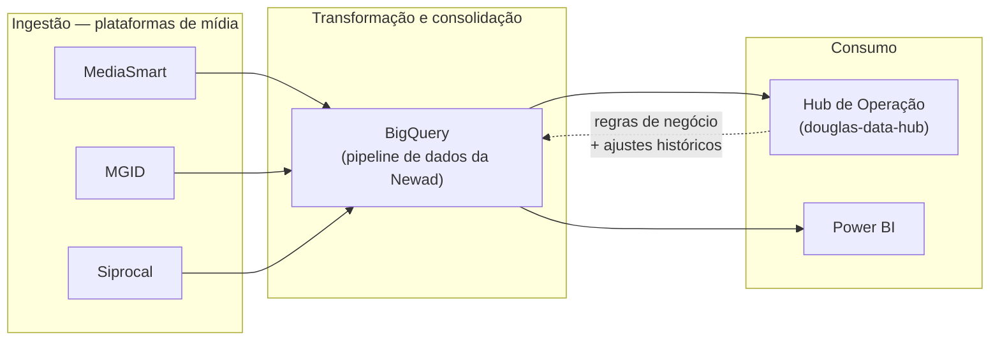

# Visão Executiva de Arquitetura

> **Manutenção:** Tier 3 — revisão só quando componente novo de sistema entra (novo conector, novo canal de consumo)

Diagrama para apresentação a stakeholders não-técnicos (chefia, reuniões de status) —
mostra de onde o dado vem, o que acontece com ele, e onde ele aparece no final, sem
entrar em schema, tabela ou lógica de transformação. Para o detalhe técnico por camada
(RAW/STG/CORE/GOLD), ver `docs/raw_layer_design.md`, `docs/stg_layer_design.md` e
`docs/gold_layer_design.md`; o diagrama técnico equivalente a este (C4 Nível 3, com
componentes internos do BigQuery) ainda não existe — item bloqueado por acesso live ao
BigQuery.

**Como ler:** cada plataforma de mídia entrega seus dados de campanha e entrega
publicitária para o pipeline central no BigQuery, que consolida e organiza tudo num
único lugar. A partir daí, o dado alimenta dois canais: o Hub de Operação (painel interno
usado por Douglas para monitorar o pipeline) e o Power BI (dashboards de resultado
usados com os clientes).

> **Componente novo (2026-08-10): o Hub também alimenta o pipeline de volta, não só
> consome.** Duas capacidades novas tornam o Hub um canal de entrada além de saída: (1)
> regras de negócio configuráveis por cliente (ex: teto de 20% sobre impressões
> Native/Push) — cadastradas no Hub, aplicadas automaticamente no BigQuery a partir daí;
> (2) upload manual de planilha histórica de cliente, quando o dado real da plataforma
> não pode ser reportado (ex: período anterior à integração) — o Hub recebe o arquivo, o
> BigQuery normaliza e passa a usá-lo no lugar do dado ausente. Ambas ainda só rodam em
> ambiente de teste (`douglas-bq-staging`), não em produção — detalhe técnico completo
> (mecanismo, tabelas, divergência staging×produção) em `docs/technical_dataflow.md`.

> **Nota lateral:** o pipeline roda em dois ambientes — `adframework` (produção, os dados
> reais que alimentam Hub e Power BI) e `douglas-bq-staging` (ambiente de teste, usado
> para validar mudanças antes de irem para produção). Detalhe em `docs/environments.md`.

> **Versão visual elaborada:** existe uma versão mais elaborada deste mesmo diagrama —
> Artifact HTML autocontido (paleta neutra quente com destaque dourado ecoando a camada
> GOLD, 4 estágios de refinamento em vez de 3 caixas genéricas), publicada em
> `https://claude.ai/code/artifact/fd62018c-18e9-4a1d-b9b8-0449b4a0e0a1`. Pensada desde o
> início para ser embutida no Hub via `st.components.v1.html()`. Ainda não salva como
> arquivo neste repositório — ver task Notion "Exibir diagrama de arquitetura no Hub".
> Uma v2 com mais tecnicalidade visível está prevista após o diagrama técnico (B6) sair
> do bloqueio de acesso ao BigQuery.
