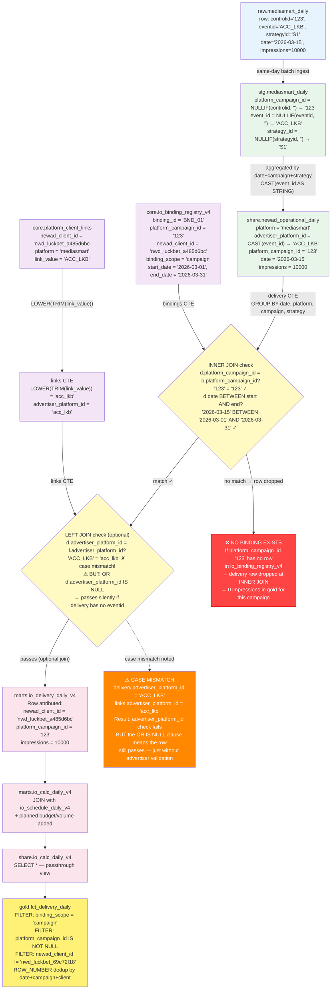

# AdFramework — Attribution Chain (Technical Detail)

> How a delivery row from MediaSmart gets attributed to a client in gold.
> Source: actual view DDL from `marts.io_delivery_daily_v4` and `stg.mediasmart_daily`.

## Key observations from the actual DDL

| Step | What the code does | Risk |
|---|---|---|
| `stg.mediasmart_daily` | `NULLIF(controlid, '')` — empty strings become NULL | NULL campaign_id is filtered out downstream |
| `share.newad_operational_daily` | `CAST(event_id AS STRING)` — no LOWER, no TRIM | Case-sensitive advertiser_platform_id |
| `links CTE` in `io_delivery_daily_v4` | `LOWER(TRIM(link_value))` — normalizes the link | But delivery side is NOT lowercased — mismatch |
| `joined` CTE | `d.advertiser_platform_id = l.advertiser_platform_id OR d.advertiser_platform_id IS NULL` | If eventid is blank (NULL), the OR IS NULL lets the row through without advertiser validation |
| `stg.io_lines_v4` | `ROW_NUMBER PARTITION BY newad_client_id, proposal_month, platform_campaign_id ORDER BY io_id DESC` | If two IOs share same campaign_id in same month, only the latest survives — older is silently dropped |
| `gold.fct_delivery_daily` | `ROW_NUMBER PARTITION BY date, platform_campaign_id, newad_client_id ORDER BY proposal_month DESC` | One more dedup layer — campaign+date+client combination must be unique |
