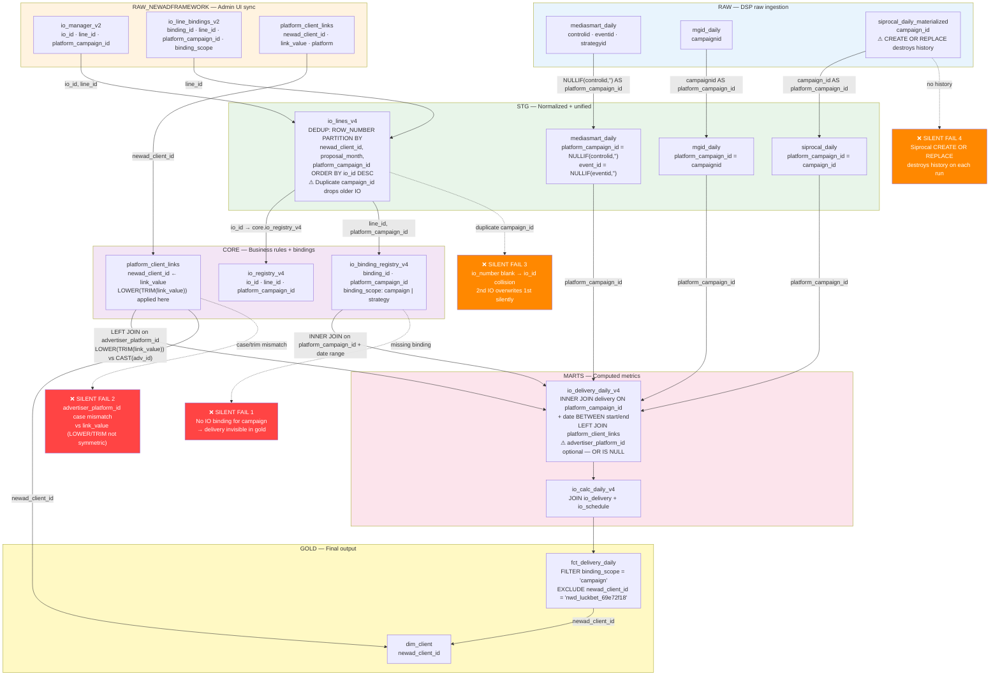

# AdFramework — Layer Flow Overview

> How delivery data travels from raw ingestion to the gold layer.
> Generated from actual view DDL — not inferred.

```mermaid
flowchart TD
    subgraph RAW["RAW — DSP raw ingestion"]
        MS["mediasmart_daily\ncontrolid · eventid · strategyid"]
        MG["mgid_daily\ncampaignid"]
        SP["siprocal_daily_materialized\ncampaign_id\n⚠ CREATE OR REPLACE destroys history"]
    end

    subgraph RAW_NWD["RAW_NEWADFRAMEWORK — Admin UI sync"]
        IO_MGR["io_manager_v2\nio_id · line_id · platform_campaign_id"]
        IO_BND["io_line_bindings_v2\nbinding_id · line_id · platform_campaign_id · binding_scope"]
        PCL["platform_client_links\nnewad_client_id · link_value · platform"]
    end

    subgraph STG["STG — Normalized + unified"]
        STG_MS["mediasmart_daily\nplatform_campaign_id = NULLIF(controlid,'')\nevent_id = NULLIF(eventid,'')"]
        STG_MG["mgid_daily\nplatform_campaign_id = campaignid"]
        STG_SP["siprocal_daily\nplatform_campaign_id = campaign_id"]
        IO_LINES["io_lines_v4\nDEDUP: ROW_NUMBER PARTITION BY\nnewad_client_id, proposal_month,\nplatform_campaign_id ORDER BY io_id DESC\n⚠ Duplicate campaign_id drops older IO"]
    end

    subgraph CORE["CORE — Business rules + bindings"]
        IO_REG["io_registry_v4\nio_id · line_id · platform_campaign_id"]
        IO_BIND["io_binding_registry_v4\nbinding_id · platform_campaign_id\nbinding_scope: campaign | strategy"]
        LINKS["platform_client_links\nnewad_client_id ← link_value\nLOWER(TRIM(link_value)) applied here"]
    end

    subgraph MARTS["MARTS — Computed metrics"]
        IO_DEL["io_delivery_daily_v4\nINNER JOIN delivery ON platform_campaign_id\n+ date BETWEEN start/end\nLEFT JOIN platform_client_links\n⚠ advertiser_platform_id optional — OR IS NULL"]
        IO_CALC["io_calc_daily_v4\nJOIN io_delivery + io_schedule"]
    end

    subgraph GOLD["GOLD — Final output"]
        FCT["fct_delivery_daily\nFILTER binding_scope = 'campaign'\nEXCLUDE newad_client_id = 'nwd_luckbet_69e72f18'"]
        DIM_C["dim_client\nnewad_client_id"]
    end

    MS -->|"NULLIF(controlid,'') AS platform_campaign_id"| STG_MS
    MG -->|"campaignid AS platform_campaign_id"| STG_MG
    SP -->|"campaign_id AS platform_campaign_id"| STG_SP

    IO_MGR -->|"io_id, line_id"| IO_LINES
    IO_BND -->|"line_id"| IO_LINES

    IO_LINES -->|"io_id → core.io_registry_v4"| IO_REG
    IO_LINES -->|"line_id, platform_campaign_id"| IO_BIND

    STG_MS -->|"platform_campaign_id"| IO_DEL
    STG_MG -->|"platform_campaign_id"| IO_DEL
    STG_SP -->|"platform_campaign_id"| IO_DEL

    IO_BIND -->|"INNER JOIN on platform_campaign_id + date range"| IO_DEL
    PCL -->|"newad_client_id"| LINKS
    LINKS -->|"LEFT JOIN on advertiser_platform_id\nLOWER(TRIM(link_value)) vs CAST(adv_id)"| IO_DEL

    IO_DEL --> IO_CALC
    IO_CALC --> FCT
    LINKS -->|"newad_client_id"| DIM_C
    FCT -->|"newad_client_id"| DIM_C

    FAIL1["❌ SILENT FAIL 1\nNo IO binding for campaign\n→ delivery invisible in gold"]
    FAIL2["❌ SILENT FAIL 2\nadvertiser_platform_id case mismatch\nvs link_value (LOWER/TRIM not symmetric)"]
    FAIL3["❌ SILENT FAIL 3\nio_number blank → io_id collision\n2nd IO overwrites 1st silently"]
    FAIL4["❌ SILENT FAIL 4\nSiprocal CREATE OR REPLACE\ndestroys history on each run"]

    IO_BIND -.->|"missing binding"| FAIL1
    LINKS -.->|"case/trim mismatch"| FAIL2
    IO_LINES -.->|"duplicate campaign_id"| FAIL3
    SP -.->|"no history"| FAIL4

    style FAIL1 fill:#ff4444,color:#fff
    style FAIL2 fill:#ff4444,color:#fff
    style FAIL3 fill:#ff8800,color:#fff
    style FAIL4 fill:#ff8800,color:#fff
    style RAW fill:#e8f4fd
    style RAW_NWD fill:#fff3e0
    style STG fill:#e8f5e9
    style CORE fill:#f3e5f5
    style MARTS fill:#fce4ec
    style GOLD fill:#fff9c4
```
