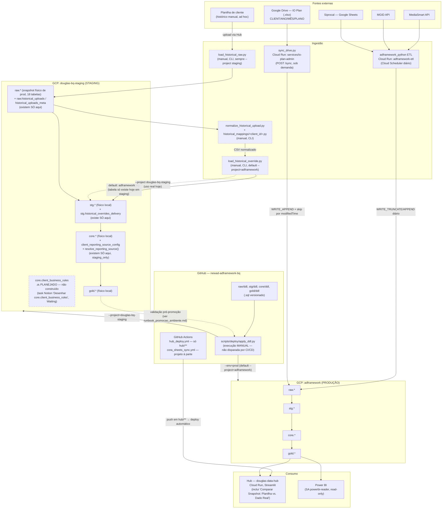
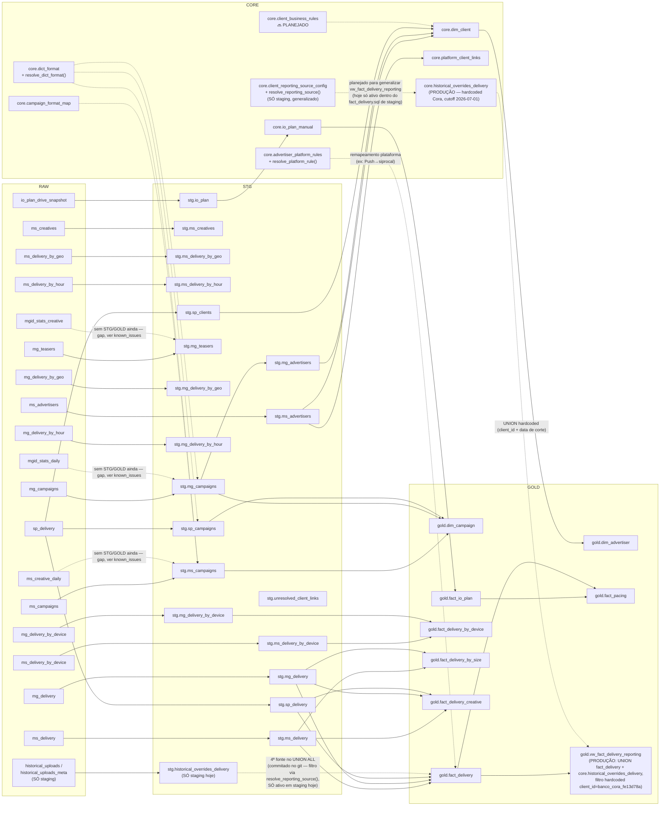

# Diagrama Técnico — Topologia de Sistema + DFD Medallion

> **Manutenção:** híbrido de dois tiers, cada seção com gatilho próprio.
> - **Diagrama 1 (Topologia de Sistema)** — Tier 2. Muda por decisão de arquitetura/deploy
>   (novo repositório, novo projeto GCP, novo consumidor, novo workflow de CI/CD) — não é
>   gerado de `INFORMATION_SCHEMA`, é lido do código real (`apply_ddl.py`,
>   `.github/workflows/*.yml`, `docs/io_plan_domain.md`, scripts de override histórico).
>   Revisitar quando qualquer uma dessas peças mudar de lugar ou de mecanismo.
> - **Diagrama 2 (DFD Medallion)** — Tier 1. Nomes de tabela/view devem ser regenerados por
>   consulta a `INFORMATION_SCHEMA.TABLES`/`VIEWS` dos dois projetos (`adframework`,
>   `douglas-bq-staging`) sempre que houver dúvida se está desatualizado — não editar de
>   memória.
>
> Verificado ao vivo em **2026-08-09** contra `adframework` (produção) e
> `douglas-bq-staging` (staging), via `INFORMATION_SCHEMA.TABLES`/`VIEWS` dos dois projetos
> + leitura de `scripts/deploy/apply_ddl.py`, `.github/workflows/*.yml`,
> `scripts/deploy/load_historical_raw.py`/`normalize_historical_upload.py`/
> `load_historical_override.py`, `docs/io_plan_domain.md` e `docs/runbook_promocao_ambiente.md`.

---

## Diagrama 1 — Topologia de Sistema (C4 Nível 2 — Containers)

Mostra como o código sai do GitHub e vira schema aplicado no BigQuery, os dois projetos
GCP como blocos distintos, os consumidores finais, e onde cada mecanismo de ingestão
(diário via API, Drive, upload manual de histórico) se encaixa.

**Notas de precisão (não simplificar na próxima edição sem reconfirmar):**
- `apply_ddl.py` **nunca roda via GitHub Actions** — é sempre execução manual (Douglas ou
  um agente com acesso ao BigQuery). O único workflow de CI/CD real do repo que faz deploy
  automático é `hub_deploy.yml` (só para `hub/**`). `cora_sheets_sync.yml` existe no mesmo
  repo mas escreve num projeto GCP totalmente à parte (`striped-bonfire-489318-t9`,
  dashboard emergencial temporário — fora do escopo deste diagrama).
- A árvore de **dado histórico manual** é genuinamente separada da ingestão diária: 3
  scripts CLI distintos, cada um rodado à mão, em sequência (`load_historical_raw.py` →
  `normalize_historical_upload.py` → `load_historical_override.py`), sem Cloud Scheduler
  nem gatilho automático. As duas primeiras etapas só têm onde rodar em
  `douglas-bq-staging` (`raw.historical_uploads`/`historical_uploads_meta` não existem
  fisicamente em produção). `load_historical_override.py` aceita `--project` apontando
  para produção (`adframework`, valor default do flag), mas como a tabela-alvo
  (`stg.historical_overrides_delivery`) **não existe ainda em produção** (só em staging —
  confirmado ao vivo em 2026-08-09), o uso real hoje é sempre com
  `--project douglas-bq-staging`.
- `core.client_business_rules` é **planejado, não construído** (task Notion "Desenhar
  core.client_business_rules", `Status: Waiting`) — não existe em nenhum dos dois projetos
  (confirmado ao vivo em 2026-08-09). Representado tracejado de propósito para não misturar
  estado real com estado desejado.
- Staging não espelha produção 1:1: produção não tem `raw.historical_uploads`/
  `historical_uploads_meta`, `stg.historical_overrides_delivery`,
  `core.client_reporting_source_config` nem `core.resolve_reporting_source()` — essas 4
  peças existem **só** em `douglas-bq-staging`, de propósito (MVP validado, ainda não
  promovido). Staging também tem um dataset a mais sem equivalente em produção:
  `stg_workbench` (não coberto neste diagrama, fora do escopo do pipeline oficial).

### Componente no diagrama → implementação real

| Componente no diagrama | Implementação real |
|---|---|
| MediaSmart / MGID / Siprocal API → ETL | `adframework_python` (repo irmão, Cloud Run `adframework-etl`) |
| Google Drive → IO Plan | `scripts/io_plan/sync_drive.py`, serviço `services/io-plan-admin/main.py` (endpoint `POST /sync`) |
| Planilha de cliente → histórico manual | `scripts/deploy/load_historical_raw.py` → `scripts/deploy/normalize_historical_upload.py` (+ `scripts/deploy/historical_mappings/<client_id>.py`) → `scripts/deploy/load_historical_override.py` |
| BigQuery RAW/STG/CORE/GOLD (DDL versionado) | `raw/ddl/*.sql`, `stg/ddl/*.sql`, `core/ddl/*.sql`, `gold/ddl/*.sql` |
| Deploy de schema (manual, 2 níveis test/prod) | `scripts/deploy/apply_ddl.py` |
| GitHub Actions (CI/CD) | `.github/workflows/hub_deploy.yml` (deploy automático do Hub), `.github/workflows/cora_sheets_sync.yml` (cron à parte, projeto `striped-bonfire-489318-t9`) |
| Hub | `hub/app.py`, `hub/deploy.sh`, Cloud Run `douglas-data-hub` |
| Power BI | Service Account `powerbi-reader` (read-only), lê `gold.*` diretamente |
| Promoção staging → produção | `docs/runbook_promocao_ambiente.md` (processo), `scripts/deploy/apply_ddl.py --project douglas-bq-staging` → `--env=prod` |

---

## Diagrama 2 — DFD Medallion (fluxo de dado dentro do BigQuery)

Nomes reais de tabela/view, produção (`adframework`) salvo indicação contrária. Onde
staging diverge de produção, ambos os estados aparecem lado a lado.

**Como ler as linhas tracejadas:** dependência condicional/planejada/parcial — não o
caminho principal de dado. Linhas sólidas = `UNION`/`JOIN`/`SELECT FROM` real e ativo hoje.

**Confirmado ao vivo em 2026-08-09 — divergência de topologia do override histórico entre
produção e staging (ponto mais importante deste diagrama):**
- **Em produção**, o mecanismo é o antigo, hardcoded: `gold.vw_fact_delivery_reporting`
  faz `UNION ALL` entre `gold.fact_delivery` (tudo, exceto Cora antes de 2026-07-01) e
  `core.historical_overrides_delivery` (só Cora, só antes de 2026-07-01) — `client_id` e
  data de corte literais na definição da view.
- **Em staging**, o mecanismo generalizado (por cliente, via `core.resolve_reporting_source()`
  + `core.client_reporting_source_config`) já está embutido diretamente dentro de
  `gold/ddl/fact_delivery.sql` (4ª fonte do `UNION ALL`, lendo
  `stg.historical_overrides_delivery`) — validado ponta-a-ponta (ver `known_issues.md`
  R1/R2/`docs/environments.md`), mas **nunca promovido para produção**.
- As duas árvores de dado histórico (Drive/IO Plan vs. upload manual de override) são
  mecanismos completamente distintos — não confundir: IO Plan é sobre **planejamento**
  (budget), override histórico é sobre **substituir entrega real** por dado retroativo
  quando a plataforma não tinha o histórico.

### Componente no diagrama → implementação real

| Componente no diagrama | Implementação real |
|---|---|
| RAW (ingestão diária MS/MGID/Siprocal) | `raw/ddl/*.sql` |
| RAW → STG (resolução client_id/formato) | `stg/ddl/*.sql` |
| CORE (regras versionadas SCD2) | `core/ddl/dict_format.sql`, `core/ddl/advertiser_platform_rules.sql`, `core/ddl/campaign_format_map.sql`, `core/ddl/resolve_dict_format.sql`, `core/ddl/resolve_platform_rule.sql` |
| GOLD (agregação final) | `gold/ddl/fact_delivery.sql`, `gold/ddl/fact_pacing.sql`, `gold/ddl/dim_campaign.sql`, etc. |
| IO Plan (Drive → RAW → CORE → GOLD) | `scripts/io_plan/sync_drive.py`, `raw/ddl/io_plan_drive_snapshot.sql` (schema), `stg/ddl/io_plan.sql`, `core/ddl/io_plan_manual.sql` (ver `docs/io_plan_domain.md` para o pipeline completo) |
| Override histórico — produção (hardcoded) | `gold/ddl/vw_fact_delivery_reporting.sql`, `core/ddl/historical_overrides_delivery.sql` |
| Override histórico — staging (generalizado, não promovido) | `core/ddl/client_reporting_source_config.sql`, `core/ddl/resolve_reporting_source.sql`, `stg/ddl/historical_overrides_delivery.sql`, `gold/ddl/fact_delivery.sql` (4ª fonte do UNION, só ativa em staging) |
| Upload de histórico (raw → normalizado → carregado) | `scripts/deploy/load_historical_raw.py` → `scripts/deploy/normalize_historical_upload.py` → `scripts/deploy/load_historical_override.py` |
| `core.client_business_rules` (planejado) | Não implementado — task Notion "Desenhar core.client_business_rules" |

---

## Gaps conhecidos já documentados em outro lugar (não repetidos aqui em detalhe)

- `mgid_stats_daily`, `mgid_stats_creative`, `ms_creative_daily` existem em RAW mas ainda
  sem STG/GOLD correspondente — ver `docs/raw_layer_design.md` e `docs/known_issues.md`.
- `_resolve_test_simple` (função órfã em `core`, só existe em produção — confirmado ausente
  em `douglas-bq-staging`) — ver `core/OWNERSHIP.yaml`.

## Achados da varredura de reconhecimento (2026-08-09) — não fazem parte dos diagramas

Antes de fechar B6, foi feita uma varredura completa de todas as pastas de primeiro/segundo
nível do repo (`raw/`, `stg/`, `core/`, `gold/`, `scripts/`, `hub/`, `services/`, `agents/`,
`.github/`, `audit/`) e de `INFORMATION_SCHEMA.ROUTINES` dos dois projetos, pra garantir que
nenhum componente real ficasse de fora por reação só às correções pontuais já incorporadas
acima. Achados que **não** entraram nos diagramas, com o motivo:

- **`gold/delivery/*.sql`, `gold/creative/*.sql`, `gold/dimensions/dim_client_semantics.sql`**
  — arquivos `.sql` no repo que **não correspondem a nenhum objeto vivo em produção nem em
  staging** (confirmado via `INFORMATION_SCHEMA.TABLES`/`VIEWS` dos dois projetos, zero
  resultados para os 7 nomes). `dim_client_semantics.sql` em especial usa o formato de
  `client_id` antigo pré-rebuild (`nwd_luckbet_a485d6bc`, prefixo `nwd_`) — mesma categoria
  de objeto morto já registrada em `known_issues.md` A4/A5/C1 (fechados nesta sessão, ver
  seção correspondente). Não representados no DFD por não serem parte do caminho de dado
  real hoje.
- **`core/migration/*.sql`, `raw/migration/*.sql`, `raw/execute/*.sql`, `core/seeds/*.csv`**
  — scripts de migração/seed numerados (`01_...`, `02_...`), já executados uma vez cada,
  históricos — não são componentes recorrentes do pipeline, são o "como as tabelas `core`/
  `raw` chegaram no estado atual". Não representados no diagrama de topologia (que descreve
  o fluxo recorrente, não o histórico de como se chegou lá).
- **`audit/client_analysis/*.sql`, `audit/raw_layer/*.sql`, `scripts/data_quality/*.sql`,
  `scripts/inspect/*.sql`** — queries SQL ad hoc de auditoria/inspeção, rodadas manualmente
  quando necessário, sem agendamento nem trigger. Não são um "container" do sistema (não
  cabem no nível C4 Containers) — ferramentas de investigação, não infraestrutura.
- **`agents/bq_validator.py`** — CLI de validação que usa a API da Anthropic para decidir
  quais queries rodar contra o BigQuery e interpretar o resultado; ferramenta de
  operação/auditoria (rodada manualmente pelo Douglas ou por um agente), não um componente
  do pipeline de dado em si.
- **`douglas-bq-staging.stg_workbench`** — dataset existe no projeto de staging mas está
  **vazio** (zero tabelas, confirmado ao vivo) — sem uso ativo hoje, não representado no
  diagrama de topologia por não ter conteúdo a mostrar.
- **`hub/jobs_config.yaml`, `hub/powerbi_status.yaml`, `hub/ddl_historical_overrides.sql`**
  — arquivos de configuração/DDL auxiliares do próprio Hub, já cobertos pela caixa única
  "Hub" no Diagrama 1 (nível de detalhe interno do Hub é escopo do `hub/README.md`, mantido
  pelo agente `hub-frontend`, não deste diagrama de pipeline de dado).

Nenhum desses achados mudou a estrutura dos 2 diagramas — todos são ferramentas auxiliares,
histórico já aplicado, ou código morto já coberto por outro doc. Sinalizados aqui para que
a lista fique auditável, não porque exigissem representação própria no desenho.
